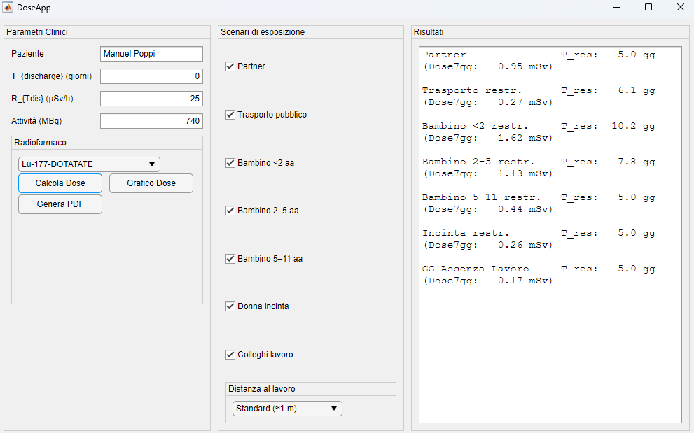
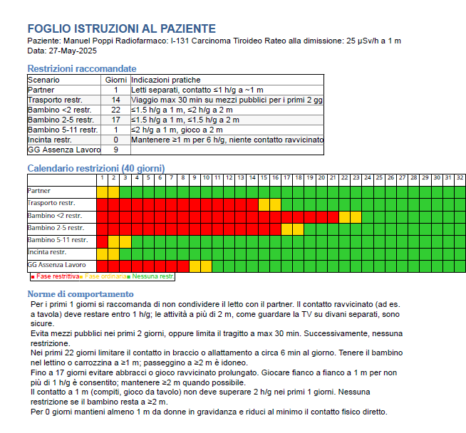

# DoseApp – Guida all'uso e documentazione tecnica

## Indice
- [Introduzione](#introduzione)
- [Requisiti software e installazione](#requisiti-software-e-installazione)
- [Modello di calcolo della dose](#modello-di-calcolo-della-dose)
- [Sistema a Plugin](#sistema-a-plugin)
- [Esempio di plugin – BiExpKineticsPlugin](#esempio-di-plugin-biexpkineticsplugin) 
- [Utilizzo della GUI](#utilizzo-della-gui)
- [Parametri clinici e farmacocinetica](#parametri-clinici-e-farmacocinetica)
- [Scenari di esposizione](#scenari-di-esposizione)
- [Report PDF di istruzioni per il paziente](#report-pdf-di-istruzioni-per-il-paziente)
- [Note tecniche e modelli matematici utilizzati](#note-tecniche-e-modelli-matematici-utilizzati)
- [Riferimenti e contatti](#riferimenti-e-contatti)

## Introduzione

**DoseApp** è uno strumento sviluppato per facilitare e migliorare la gestione delle dimissioni di pazienti sottoposti a trattamenti medico-nucleari (ad esempio, terapie con I-131 e Lu-177). Questi trattamenti comportano infatti un periodo durante il quale il paziente emette radiazioni ionizzanti potenzialmente rischiose per chi vive o lavora nelle immediate vicinanze. Diventa quindi cruciale definire con precisione i periodi di restrizione (**T<sub>res</sub>**), ovvero i giorni nei quali è necessario adottare particolari accorgimenti di distanziamento e di comportamento per tutelare familiari, bambini, donne incinte e colleghi.

Tramite un'interfaccia grafica (GUI) intuitiva, **DoseApp** permette agli operatori sanitari (in particolare, fisici medici e medici nucleari) di:

- Inserire rapidamente parametri clinici rilevanti (attività somministrata, rateo di dose alla dimissione, tipologia di radiofarmaco utilizzato).
- Selezionare specifici scenari di esposizione personalizzabili e già predefiniti sulla base di linee guida consolidate e della letteratura scientifica aggiornata.
- Stimare automaticamente i periodi di restrizione necessari, fornendo anche rappresentazioni grafiche chiare dell’andamento della dose da esposizione nel tempo.
- Generare velocemente un foglio informativo personalizzato (in formato PDF), pronto per essere consegnato direttamente al paziente, con istruzioni semplici, comprensibili e dettagliate sulle norme di comportamento da adottare.

In questo modo, **DoseApp** non solo rende più efficiente il lavoro del personale sanitario, ma contribuisce significativamente anche alla sicurezza del paziente e dei suoi conviventi, migliorando la comunicazione medico-paziente e garantendo la conformità alle normative vigenti in ambito di radioprotezione.

Questa documentazione fornisce tutte le informazioni necessarie per l'installazione, l'utilizzo quotidiano, la manutenzione e l'eventuale personalizzazione del software. Sono incluse inoltre indicazioni tecniche dettagliate per eventuali aggiornamenti, modifiche agli scenari espositivi, gestione dei dati clinici, e modelli matematici e computazionali utilizzati.

## Requisiti Software e Installazione

Questa sezione descrive i requisiti software e la procedura passo-passo per installare ed eseguire correttamente **DoseApp**.

---

### 🚩 Requisiti Software Minimi

Per utilizzare correttamente **DoseApp**, assicurarsi di disporre di:

- **MATLAB versione R2021b** (o successive)
  - Licenza valida per il MATLAB Report Generator toolbox, richiesto per la generazione automatica dei report in formato PDF.
- Sistema operativo supportato da MATLAB (Windows, macOS, Linux).
- Un editor di testo (opzionale, per la modifica dei file JSON di configurazione), ad esempio [Visual Studio Code](https://code.visualstudio.com/) o [Notepad++](https://notepad-plus-plus.org/).

---

### 📥 Procedura di Installazione

Seguire attentamente questi passaggi per installare e avviare **DoseApp**:

**1. Clonare o scaricare il repository**

Scaricare il repository completo (file `.zip`) oppure clonare direttamente da terminale tramite Git:

```bash
git clone https://github.com/nicopanico/PersonalizedDimission.git
```

**2. Aprire MATLAB e inizializzare il codice**

Avvia MATLAB e imposta la cartella contenente `PersonalizedDimission` come directory corrente.  
Dalla Command Window digita:

```matlab
addpath(genpath('PersonalizedDimission'));  % include tutte le sottocartelle
savepath;                                   % salva il percorso
```
In questo modo vengono aggiunte tutte le sottocartelle, è anche sufficiente aprire il codice direttamente da MATLAB dentro la cartella.

## Modello di calcolo della dose

DoseApp implementa un **modello di sorgente lineare** (altezza assiale $H \approx 1.70\,$m) con costante di normalizzazione $\Gamma$ scelta affinché  
$\dot D(1\text{ m}) = 1\\mu\text{Sv·h}^{-1}$ quando $A_{\text{tot}} = 1$.

La **dose-rate puntuale** a distanza $d$ vale


$$
\dot D(d)=
\Gamma\
\frac{A_{\text{tot}}}{Hd}\
\arctan\\left(\frac{H}{2d}\right)
$$


Il **fattore di correzione geometrico** usato negli scenari è il rapporto tra due dose-rate:

$$
F_{\text{corr}}(d) \=\
\frac{\dot D(d)}{\dot D(1\text{ m})}
$$

Il periodo di restrizione ottimale $T_{\text{res}}$ si ottiene risolvendo

$$
D_{\text{restr}}\bigl(T_{\text{res}}\bigr)
\+\
D_{\text{ord}}\bigl(T_{\text{res}}\bigr)
\=\
\text{DoseConstraint}
$$

dove $D_{\text{restr}}$ e $D_{\text{ord}}$ sono gli integrali dose-tempo sulle due fasi (restrittiva / ordinaria) secondo *Buonamici 2025*.  
Il metodo di bisezione implementato in `DoseCalculator.trovaPeriodoRestrizione` garantisce una tolleranza di 0.01 giorni.

> Per l’implementazione completa dei modelli, vedi anche la sezione [Note tecniche e modelli matematici utilizzati](#note-tecniche-e-modelli-matematici-utilizzati).

## Sistema a plugin
<a name="sistema-a-plugin"></a>

**DoseApp** può essere esteso senza toccare il core grazie a un sistema di plugin caricati all’avvio.

| Cartella | Scopo |
|----------|-------|
| `plugins/` | contiene i file `.m` dei plugin |
| `DoseAppPluginBase.m` | interfaccia astratta che tutti i plugin devono derivare |

### Workflow

1. **Avvio app** → `DoseApp` scansiona `plugins/*.m`.  
2. Se la prima classe trovata eredita da `DoseAppPluginBase`, ne crea un’istanza.  
3. Aggiunge una voce nel menu **Plugins**:  
   ```matlab
   uimenu(app.MenuPlugins,'Text',obj.pluginName(), ...
          'MenuSelectedFcn',@(~,~)app.openPlugin(obj));

Alla selezione la GUI principale chiama `openPlugin`, che apre una nuova `uifigure`
e invoca `obj.init(appHandle, parentFig)`.

### API essenziale
```matlab
classdef (Abstract) DoseAppPluginBase < handle
    methods (Abstract)
        name = pluginName(obj)                  % testo da mostrare nel menu
        init(obj, appHandle, parentContainer)   % costruisce la UI del plugin
    end
end

### Scheletro di un nuovo plugin
```matlab
classdef MyPlugin < DoseAppPluginBase
    properties (Access = private)
        App   % handle a DoseApp
    end

    function name = pluginName(~)
        name = "My-Plugin";
    end

    function init(obj, app, parent)
        obj.App = app;

        % layout 2×2
        gl = uigridlayout(parent,[2 2]);

        uilabel(gl,"Text","Demo");

        uibutton(gl,"Text","Run", ...
            "ButtonPushedFcn",@(~,~)uialert(parent,"Done","My-Plugin"));
    end
end
```
## Esempio di plugin – **BiExpKineticsPlugin**
<a name="esempio-di-plugin-biexpkineticsplugin"></a>

Il plugin **BiExpKineticsPlugin** consente di stimare in pochi secondi i
parametri di una cinetica bi-esponenziale a partire da **quattro misure di
rateo** (µSv · h⁻¹) effettuate dopo la somministrazione del radiofarmaco.

### Obiettivo

Stimare  

$$
A(t)=A_{\text{tot}}\,[f_{1}e^{-\lambda_{1}t}+f_{2}e^{-\lambda_{2}t}],
\qquad
f_{1}+f_{2}=1
$$

ricavando le **frazioni** $(f_{1},f_{2})$ e le **costanti** di decadimento
$(\lambda_{1},\lambda_{2})$ (in giorni⁻¹) tramite **lsqcurvefit**.

### Interfaccia rapida

| Campo | Descrizione |
|------|-------------|
| **Ora [h]** (×4) | tempo della misura (es. 0, 4, 24, 48 h) |
| **Rateo [µSv/h]** (×4) | valore corrispondente misurato a 1 m |
| **Stima cinetica** | avvia il fit non-lineare |
| **Risultati** | mostra \(f_{1},\lambda_{1},f_{2},\lambda_{2}\) in formato Buonamici |


## Utilizzo della GUI



L’interfaccia di **DoseApp** è suddivisa in tre colonne:

| # | Pannello | Funzione principale |
|---|----------|--------------------|
| **①** | **Parametri clinici** | Inserisci nome paziente, *T*<sub>discharge</sub>, rateo di dimissione e radio-farmaco. <br> Contiene i pulsanti **Calcola Dose**, **Grafico Dose** e **Genera PDF**. |
| **②** | **Scenari di esposizione** | Spunta uno o più scenari restrittivi (partner, bambino, colleghi, ecc.). <br> Per **Colleghi** appare un menu a tendina per scegliere la distanza “Standard ≈ 1 m” o “Sempre ≥ 2 m”. |
| **③** | **Risultati** | Mostra, per ogni scenario selezionato, il periodo ottimale di restrizione **T**<sub>res</sub> (in giorni) e la dose cumulativa a 7 gg. <br> I valori sono in grassetto e separati da una riga vuota per facilitarne la lettura. |

---
> Consiglio rapido: dopo aver compilato i parametri e selezionato gli scenari, premi **Genera PDF** per ottenere il foglio istruzioni da consegnare al paziente.

### Passaggi rapidi

1. **Compila i parametri clinici**  
   - Nome paziente (facoltativo)  
   - *T*<sub>discharge</sub> (giorni)  
   - Rateo *R*<sub>T dis</sub> (µSv / h @ 1 m)  
   - Attività somministrata (MBq)  
   - Seleziona il radiofarmaco dal menu a tendina

2. **Seleziona gli scenari**  
   Spunta le caselle corrispondenti alle restrizioni da valutare.  
   È possibile selezionare più scenari contemporaneamente.

3. **Calcola o visualizza**  
   - **Calcola Dose**: popola il riquadro “Risultati” con **T**<sub>res</sub> e dose 7 gg.  
   - **Grafico Dose**: apre la curva -dose vs *T*<sub>res</sub> con evidenza del limite di dose.

4. **Genera il PDF**  
   - Clicca **Genera PDF** → scegli dove salvare il file.  
   - Il report include intestazione, tabella riassuntiva, calendario “semaforo” a 40 gg e spiegazioni discorsive per ogni scenario.

---

### Suggerimenti utili

| Esigenza | Operazione |
|----------|------------|
| Aggiornare parametri farmacocinetici | Modifica `radiopharmaceuticals.json`, poi riavvia l’app |
| Aggiungere un nuovo scenario | Implementa il metodo statico in `Scenario.m` **e** aggiorna `doseApp.pairMap` / `pairMapOrd` |
| Cambiare altezza sorgente lineare | Modifica il costruttore `ModelloLineare( H )` (riga 183 di `DoseApp.m`) |
| PDF non generato | Verifica licenza Report Generator:<br>`license('test','MATLAB_Report_Gen')` deve restituire `1` |

> Per dubbi o segnalazioni apri pure una *Issue* su GitHub o contatta il maintainer indicato in [Riferimenti e contatti](#riferimenti-e-contatti).
---

## Parametri clinici e farmacocinetica

La cinetica di eliminazione dei radiofarmaci è descritta in **DoseApp** da
un modello bi-esponenziale:

$$
A(t)=A_{\text{tot}}
     \Bigl[
       f_{r_1}\,e^{-\lambda_{\text{eff,1}}\,t}
       +f_{r_2}\,e^{-\lambda_{\text{eff,2}}\,t}
     \Bigr],
\qquad
\sum_i f_{r_i}=1
$$

| Variabile | Significato | Unità |
|-----------|-------------|-------|
| $f_{r_i}$ | Frazione di attività nel compartimento *i* | — |
| $\lambda_{\text{eff},i}$ | Costante di decadimento **effettiva** (biologico + fisico) | d⁻¹ |
| $A_{\text{tot}}$ | Attività somministrata | MBq |

---

### 🔬 Dataset pre-caricato

I parametri sono memorizzati in `radiopharmaceuticals.json`:

```json
[
  {
    "name": "I-131 Carcinoma Tiroideo",
    "fr":         [0.70, 0.30],
    "lambda_eff": [2.16, 0.0866]
  },
  {
    "name": "I-131 Ipotiroidismo",
    "fr":         [0.20, 0.80],
    "lambda_eff": [0.693, 0.0866]
  },
  {
    "name": "Lu-177-DOTATATE",
    "fr":         [0.44, 0.56],
    "lambda_eff": [2.25, 0.175]
  },
  {
    "name": "Lu-177-PSMA",
    "fr":         [0.44, 0.56],
    "lambda_eff": [2.25, 0.175]
  }
]
```

### 🛠️ Come aggiornare il file `radiopharmaceuticals.json`

1. **Apri il file**  
   Si trova nella cartella principale del progetto. Usa un editor di testo
   (es. VS Code, Notepad++, Sublime).

2. **Aggiungi o modifica un blocco JSON**

   Ogni radio-farmaco è un oggetto con tre campi obbligatori:

   ```jsonc
   {
     "name": "Nuovo-Radiofarmaco",
     "fr":         [f1, f2],        // due frazioni che sommano a 1
     "lambda_eff": [λ1, λ2]        // corrispondenti costanti (d⁻¹)
   }

**Linee guida**

- Usa **punto decimale** (`0.175`, non `0,175`).
- Mantieni **esattamente 2** componenti in `fr` e `lambda_eff`.
- Controlla che `f1 + f2 = 1`.
- Inserisci una virgola `,` **fra gli oggetti JSON**, tranne dopo l’ultimo elemento.

**Convalida il JSON**

1. Copia‐incolla il contenuto in un validator online (ad es. <https://jsonlint.com>).  
2. Salva il file **solo se** il validator restituisce “Valid JSON”.

> **Se la GUI non vede il nuovo radiofarmaco**
> - Verifica la sintassi del file JSON.  
> - Chiudi e riapri MATLAB (oppure esegui `clear all` in Command Window).
---
### 📚 Bibliografia — dati farmacocinetici

| # | Riferimento (DOI) | Radio-farmaco / Parametri estratti |
|---|-------------------|------------------------------------|
| **[H1]** | Hänscheid, H. *et al.* “Time–activity curves after therapeutic administration of **¹³¹I** in differentiated thyroid cancer patients.” *J Nucl Med* 47 (2006) 1481-1487. **doi:10.2967/jnumed.106.033860** | I-131 carcinoma tiroideo – $f_{r}$, $\lambda_{\text{eff}}$ |
| **[B1]** | Broggio, D. *et al.* “Discharge criteria after **¹³¹I** therapy: a dosimetric approach.” *Radiat Prot Dosimetry* 187 (2019) 135-142. **doi:10.1093/rpd/ncy236** | I-131 ipertiroidismo – $f_{r}$, $\lambda_{\text{eff}}$ |
| **[G1]** | Garske, U. *et al.* “Individualised dosimetry for patients receiving therapy with **¹⁷⁷Lu-DOTATATE**.” *Eur J Nucl Med Mol Imaging* 39 (2012) 1688-1696. **doi:10.1007/s00259-012-2182-3** | Lu-177-DOTATATE – $f_{r}$, $\lambda_{\text{eff}}$ |
| **[V1]** | Violet, J. *et al.* “Prospective study of **¹⁷⁷Lu-PSMA-617** theranostics in men with metastatic prostate cancer.” *Lancet Oncol* 21 (2020) 140-152. **doi:10.1016/S1470-2045(19)30684-5** | Lu-177-PSMA – $f_{r}$, $\lambda_{\text{eff}}$ |

> I valori di frazione ($f_{r}$) e costante di decadimento effettiva ($\lambda_{\text{eff}}$) inclusi nel file `radiopharmaceuticals.json`
> sono stati digitalizzati o dedotti dalle curve tempo-attività presentate nei lavori sopra elencati.
---
## Scenari di esposizione

Gli scenari di esposizione implementati in **DoseApp** sono
l’adattamento operativo delle Tabelle 2-3 del lavoro di  
Buonamici *et al.* (2025), rivisitati con la pratica clinica del
nostro Centro.

*Ogni scenario è codificato nel file `Scenario.m` come metodo `Static`
che restituisce un oggetto `Scenario` con:*

| Proprietà | Significato |
|-----------|-------------|
| `distanze` | vettore delle distanze (m) considerate nelle 24 h |
| `tempi`    | ore/gg a ciascuna distanza (stessa lunghezza di `distanze`) |
| `DoseConstraint` | vincolo di dose per l’esposo 🡒 serve al calcolo di $T_\text{res}$ |

---

### 🔒 Fase restrittiva

| Nome GUI | Distanza / Tempo (h · d⁻¹) | Vincolo (mSv) | Motivazione clinica sintetica |
|----------|---------------------------|---------------|--------------------------------|
| **Partner** | 1 m  ➝  2 h | 3 | Evita condivisione letto; contatto ravvicinato ridotto a pasti/TV |
| **Bambino \< 2 aa** | 1 m → 1.5 h  ·  2 m → 2 h | 1 | Neonato/infante: non allatta, contatto ravvicinato limitato |
| **Bambino 2–5** | 1 m → 1.5 h  ·  2 m → 1.5 h | 1 | Gioco vicino ma senza tenerlo in braccio > 10 min |
| **Bambino 5–11** | 1 m → 2.5 h | 1 | Compiti, pasti al tavolo, niente “abbracci lunghi” |
| **Trasporto** | 0.5 m → 0.5 h | 0.3 | Evitare mezzi affollati > 30 min nei primi 2 gg |
| **Donna incinta** | 1 m → 2 h | 1 | Nessun contatto < 1 m; evita sedersi accanto a lungo |
| **Assenza lavoro** | — (nessuna distanza) | 0.3 | Congedo INPS: non in ufficio fino a fine $T_\text{res}$ |

> Le durate ottimali $T_\text{res}$ (15 gg partner, 39/32/24 gg bambini,
> 22 gg colleghi, …) sono calcolate dalla classe `DoseCalculator`
> soddisfacendo i vincoli di dose sopra indicati.

---

### 👥 Fase ordinaria

Dopo il periodo restrittivo il paziente rientra in una routine più
elastica; gli scenari “ordinari” riflettono una **giornata tipo** con
contatti prolungati ma a distanze maggiori.

| Nome GUI | Distanza / Tempo (h · d⁻¹) | Note |
|----------|---------------------------|------|
| **Partner (ord.)** | 0.3 m → 6 h · 1 m → 3.5 h · 2 m → 9.5 h | Condivisione stanza, letto matrimoniale |
| **Bambino \< 2 (ord.)** | 0.1 m → 1.5 h · 0.3 m → 4 h · 1 m → 6 h · 2 m → 12 h | Include poppata e gioco assistito |
| **Bambino 2–5 (ord.)** | 0.1 m → 2 h · 2 m → 6 h · lontano → 16 h | |
| **Bambino 5–11 (ord.)** | 0.5 m → 2.5 h · 1 m → 3 h · 2 m → 6 h | |
| **Colleghi (ord.)** | 1 m → 8 h · lontano → 16 h | Rientro standard a scrivania vicina |
| **Colleghi ≥ 2 m** | 2 m → 8 h · lontano → 16 h | Opzione “Sempre ≥ 2 m” in GUI |
| **Trasporto (ord.)** | 0.3 m → 1 h · 1 m → 2 h · lontano → 21 h | |
| **Donna incinta (ord.)** | 1 m → 6 h · lontano → 18 h | |

---
> Tutti i contatti sopra i 2m sono considerati trascurabili e negligibili ai fini della dose

### ✏️ Come modificare/creare scenari

1. **Apri `Scenario.m`.**  
2. Copia uno dei metodi statici e rinominalo, ad es. `Partner_NoNight`.
3. Regola `distanze`, `tempi` (in ore/24 h) e, se serve, il vincolo
   `DoseConstraint`.  
4. Aggiungi la factory al blocco `pairMap` / `pairMapOrd`
   (file `DoseApp.m`, costruttore).  
5. Riavvia l’app: la nuova voce apparirà nelle CheckBox della colonna 2.

Le descrizioni per il paziente sono generate dalle funzioni
`restr2human` (tabella riepilogo) e `restr2para`
(testo discorsivo nel PDF): se crei un nuovo scenario, **aggiungi** la
corrispondente chiave nei due `switch‐case`.

## Report PDF di istruzioni per il paziente

Il foglio di dimissione in formato **PDF** fornisce al paziente – in
linguaggio semplice – le restrizioni post-terapia personalizzate
calcolate da **DoseApp**.

---

### 📄 Contenuto del documento

| Sezione | Descrizione |
|---------|-------------|
| **Intestazione** | Nome paziente, radiofarmaco somministrato, rateo alla dimissione, data. |
| **Tabella “Restrizioni raccomandate”** | Elenco degli scenari selezionati con <br>• `T_res` (giorni) calcolato <br>• descrizione sintetica della norma (colonna “Indicazioni pratiche”). |
| **Calendario a colori 40 gg** | Griglia “semaforo” (rosso = fase restrittiva, giallo = transizione, verde = nessuna restrizione) che il paziente può spuntare giorno per giorno. |
| **Norme di comportamento** | Paragrafi discorsivi generati da `restr2para` per ogni scenario, con esempi pratici (es. “dormi in un letto separato”, “non tenere il bimbo in braccio > 10 min”). |
| **Firma medico** | Riquadro per firma manuale. |

> **Nota** – Il layout è definito dalla classe `DReportBuilder`
> (cartella *Matilda/classes*).  Può essere personalizzato
> modificando stile, loghi, colori ecc. tramite DOM API.

---

### 🖱️ Generazione dal pulsante **“Genera PDF”**

1. **Compila** il nome paziente e gli altri parametri clinici.
2. **Seleziona** uno o più scenari nella colonna “Scenari di esposizione”.
3. Clicca **Genera PDF** → scegli la cartella di salvataggio.  
   DoseApp crea subito il file e lo apre con il visualizzatore predefinito.



---

### 🔧 Personalizzazioni rapide

| Modifica | Dove intervenire |
|----------|------------------|
| **Testo norme discorsive** | Funzione `restr2para` in `DReportBuilder.m`. |
| **Stile (font, colori)** | Blocchi `Style = {...}` all’interno di `build()`. |
| **Aggiunta logo del Centro** | Inserire un oggetto `Image()` dopo l’intestazione. |
| **Lingua/terminologia** | Stringhe fisse nella stessa classe (Heading, label colonne, ecc.). |

---

### ❓ Domande frequenti

* **Il PDF non si apre.** Assicurati di avere un lettore PDF installato
  (Windows: *Adobe Acrobat Reader*, macOS: *Preview*).
* **Compare un errore “Report Generator license”.**  
  Verifica la presenza del toolbox con  
  `license('test','MATLAB_Report_Gen')` (deve restituire `1`).
* **Alcune caselle della griglia semaforo mancano di bordo.**  
  MATLAB ≤ R2021b semplifica i bordi sottili in stampa.  
  Aumenta lo spessore (`'0.5pt'`) in `borderThin` se necessario.

  ## Note tecniche e modelli matematici utilizzati
<a name="note-tecniche-e-modelli-matematici-utilizzati"></a>

Questa sezione descrive – in forma sintetica ma completa – i modelli fisici,
radiobiologici e numerico-computazionali alla base di **DoseApp**.

---

### 1. Modello geometrico ― “line-source” assiale

| Simbolo | Valore predefinito | Significato                          |
|---------|-------------------|--------------------------------------|
| `H`     | 1.70 m            | altezza della sorgente lineare (paziente) |
| `Γ`     | `H / atan(H/2)`   | costante di normalizzazione s.t. **Ḋ(1 m) = 1 µSv h⁻¹** per *A*<sub>tot</sub>=1 |

Dose-rate puntuale a distanza *d*:

$$
\dot D(d)=
\Gamma\,
\frac{A_{\text{tot}}}{H\,d}\;
\arctan\!\Bigl(\tfrac{H}{2d}\Bigr)
$$

Il **fattore geometrico** di correzione impiegato negli scenari è

$$
F_{\text{corr}}(d)=\frac{\dot D(d)}{\dot D(1\text{ m})}
$$

---

### 2. Modello farmacocinetico bi-esponenziale

Attività residua nel corpo del paziente:

$$
A(t)=A_{\text{tot}}\,
\Bigl[f_1\,e^{-\lambda_1 t}+f_2\,e^{-\lambda_2 t}\Bigr],
\quad
f_1+f_2=1
$$

*Input* dall’array `radiopharmaceuticals.json`  
(unità di misura: λ in **d⁻¹**).

---

### 3. Integrazione dose su due fasi

Per ogni scenario si distinguono:

| Fase | Intervallo | Contatto | Dose parziale |
|------|------------|----------|---------------|
| **Restrittiva** | 0 → *T*<sub>res</sub> | distanze/tempi dello scenario “restr.” | \(D_{\text{restr}} = \sum_i \dfrac{f_i}{\lambda_i}\,F_r\,[1-e^{-\lambda_i T_{\text{res}}}]\) |
| **Ordinaria**   | *T*<sub>res</sub> → ∞ | distanze/tempi scenario “ord.”        | \(D_{\text{ord}}  = \sum_i \dfrac{f_i}{\lambda_i}\,F_o\, e^{-\lambda_i T_{\text{res}}}\) |

Dose settimanale visualizzata in GUI:

$$
D_{7\text{ gg}} = (\dot D_{T_\text{dis}})\;24\;
\frac{D_{\text{restr}}+D_{\text{ord}}}{1000}\;\text{[mSv]}
$$

dove $(\dot D_{T_\text{dis}})$ è il rateo alla dimissione (µSv h⁻¹).

---

### 4. Calcolo ottimo \(T_{\text{res}}\)

Si risolve l’equazione

$$
D_{\text{restr}}(T)+D_{\text{ord}}(T)=\text{DoseConstraint}
$$

mediante **bisezione** su \([0.1,\,60]\) giorni, tolleranza `0.01` d.
 
*Worst-case* → 20 iterazioni (trascurabile in MATLAB).

---

### 5. Stima parametri da quattro misure (plugin)

Fit non-lineare (LSQ) del modello:

$$
y(t)=A_1 e^{-\lambda_1 t}+A_2 e^{-\lambda_2 t}
$$

*Toolbox* utilizzato: **Optimization Toolbox** → `lsqcurvefit`  
   • limiti `lb=[0,0,0,0]`, `ub=Inf`.  
Output convertito in \(f_i,\lambda_i\) (λ in d⁻¹) e
(*opzionale*) esportato in `radiopharmaceuticals.json`.

---

### 6. Precisione numerica

| Quantità | Tolleranza / Note |
|----------|------------------|
| integrazione dose | analitica → errore macchina |
| bisezione \(T_{\text{res}}\) | ≤ 0.01 d |
| somma frazioni \(f_1+f_2\) | verificata | 
| unità | λ sempre in **d⁻¹** dopo conversione |


---

### 7. Riferimenti principali

| ID | Citazione sintetica |
|----|---------------------|
| **[BB25]** | Banci Buonamici *et al.* “Discharge optimisation after radionuclide therapy”, *J Radiol Prot* 43 (2025) 021504. |
| **[H06]** | Hänscheid *et al.* “¹³¹I time–activity curves…”, *J Nucl Med* 47 (2006) 1481-1487. |
| **[G12]** | Garske *et al.* “Individualised dosimetry with ¹⁷⁷Lu-DOTATATE”, *EJNMMI* 39 (2012) 1688-1696. |

Per la bibliografia completa vedi la sezione **Riferimenti** del README.

